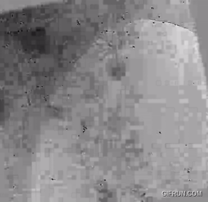
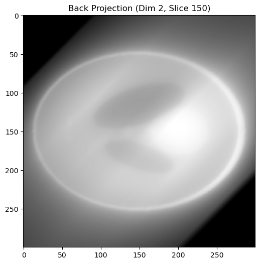

<!-- _class: cover_f -->
<!-- _paginate: "" -->
<!-- _footer: ""-->
<!-- _header:  -->

# <!-- fit --> Optimal Back-Projection for Tomography
###### 3D Filter for Enhanced Reconstruction Quality

**Zhiping Wang** <zhiping.wang@stud.unibas.ch>
Master Student  in *Physics of Life*
Biozentrum
$11$, March, $2025$

---

<!-- _class: toc_c -->
<!-- _header: "Outline" -->
<!-- _footer: "" -->
<!-- _paginate: "" -->

- Research Background
- Methods
- Results
  - On the SHREC dataset – good results
  - On the real dataset – challenges remain
- Discussion and Conclusion
- Thanks

## Research Background

<!-- _class: trans -->
<!-- _footer: "" -->
<!-- _paginate: "" -->

### Cryo-ET 3D reconstruction

<!-- _class: cols-2 -->

raw data
 

(https://www.youtube.com/watch?v=SbEvuSgskWw)

3d result
 

(https://www.youtube.com/watch?v=mePLPzK15R8)

<!-- 
## How to Realize 3D Reconstruction

**1. Fourier Synthesis**
   - Concept: Relies on the **central slice theorem** to reconstruct in Fourier space.
   - Key Feature: Simple and direct, but computationally intensive due to large Fourier transforms.

**2. Backprojection**
   - Concept: Projects densities directly into a 3D real-space volume.
   - Key Feature: Retains high-resolution details but may have lower contrast compared to iterative methods.

**3. Iterative Methods**
   - Concept: Refinement through iterative minimization of projection errors.
   - Key Feature: Produces high-contrast reconstructions with better noise suppression, but may lose high-resolution details.

**4. Other More Methods ......** -->

## Back projection
<!-- _class: cols-2 -->

+ left: Projection of 3 points onto a line at various tilt angles.
+ middle: Backprojection of projection data into reconstruction volume(Radon transform)
+ right : reconstruction (inverse of the Radon transform )
(From Rademacher, 1992)
 
**Cons**
+ Low Contrast
+ Blur Artifacts
+ ......

### Filtered back projection

<!-- _class: cols-2-73 -->

+ Process:
  + Apply a filter to the projection data (e.g., Ram-Lak, Shepp-Logan).
  + Perform back projection to reconstruct the image.
+ Advantage:
  + Significantly reduces artifacts such as blurring caused by plain back projection.
  + Improves spatial resolution and clarity in reconstructed images.

+ Key Question:
  + **how can we get a great filter?**

## Cryo-ET Data Acquisition and Radon Transform

<!-- _class: cols-2-46 -->

The image on the left is from MyScopeCryoET2023, which illustrates the data acquisition process in Cryo-ET. The process can be mathematically described using the **Radon transform**

$$
v(\vec{r}, \theta) = \int_{-\infty}^{\infty} u(z \cos(\theta) - \vec{r} \cdot \sin(\theta), z \sin(\theta) + \vec{r} \cdot \cos(\theta)) \, dz.$$

Here, $v(\vec{r}, \theta)$ represents  projections, $u(\vec{r},z)$ is unknown 3D sample density.
We can also write it as:

$$
v(\vec{r},\theta)  = \mathcal{R}(u(\vec{r},z))$$

where $\mathcal{R}$ is Radon transform.
 

## Mathematical Model of Filtered Back-Projection

+ Filtering:
  + necessary due to the central slice theorem, 
  <!-- + low frequencies are oversampled while high frequencies are underrepresented. Therefore, a high-pass filter (e.g., a ramp or cosine filter) is applied to each projection before back-projection, here $h$ is the filter for projection  pr: -->

  + $$    \hat{v}(\vec{r}, \theta) = h(\vec{r}, \theta) * v(\vec{r}, \theta) $$
  + where  $h$ is the filter for projection
+ Back-Projection: 
  + inverse Radon transform
  + $$\tilde{u}(\vec{r},z) = \int_{-\pi}^\pi \int_{\mathbb{R}} v(\vec{s}, \theta) h(n_\theta \cdot \vec{r} - \vec{s}) \, d\vec{s} \, d\theta $$
  <!-- + Evidently, this represents the inverse Radon transform. -->
  + $$\tilde{u}(\vec{r},z) = \mathcal{R}^{-1}(\hat v(\vec r,\theta)) = \mathcal{BP}^{}(h(\vec{r}, \theta) * v(\vec{r}, \theta)) 
  $$
  + where $\mathcal{R}^{-1}$ is inversion of Randon transform, and $\mathcal{BP}$ is direct back projection.
+ **Note**: In most cases, all filters are **identical along the tilt angle dimension**
  + This is precisely what my project aims to achieve.

## My Project
 

##### Objective:
Design a filter that uses a **distinct filter for each tilt angle** to better capture information and achieve improved reconstruction results.

##### Implementation Method:
Develop an optimizable filter by iteratively refining it using publicly available models. This optimized filter is then generalized to more real experimental data.

## Methods of Optimization

<!-- _class: trans -->
<!-- _footer: "" -->
<!-- _paginate: "" -->

## Optimizing Filter: Basic Idea and Dataset

 

Optimization Approach:
- Treat the filter as an optimizable parameter.
- Run filtered back-projection with a preliminary filter and compare the resulting with the **ground truth**.
- Iteratively fine-tune the filter: Employ an optimizer to adjust the filter parameters through iterative optimization, ultimately yielding an optimal filter.

#### Question: Where Do We Get the Ground Truth?
Obtaining true ground truth from real cryo-ET data is challenging. Therefore, we select the **SHREC** 2021 cryo-ET dataset (doi: 10.2312/3dor.20211307), which is a simulated cryo-ET dataset offering known ground truth information and is highly suitable for training. We first train on this dataset and then transfer the optimized filter to real data.

## Data Representation and Dimensions
 

- **Ground Truth Volume**: $x\in\mathbb{R}^{z\times x \times y}$

- **Projection Data (Tilt-Series)**: $y \in \mathbb{R}^{m \times x \times y}$ 

- **Filter Parameterization**: $\beta \in \mathbb{R}^{m \times x \times y}$

- **Reconstructed Volume**: $\hat{x}(\beta) \in \mathbb{R}^{z \times x \times y}$

FBP Reconstruction:
$$
\hat{x}(\beta) = \mathcal{R}^{-1}\bigl(y\bigr) = \mathcal{BP}(\beta * y) = \mathrm{FBP}(y, \beta)
$$

## Optimization Process - Minimizing the Loss Funcation
 

1. **Loss Funcation**
    - $L$ is the loss funcation, representing the difference between the predicted volume and the actual volume. 
    - So we need to minimize it!
<!-- 2. **Iterative Updates**  
   - Use gradient-based methods (back-propagation) to compute $\nabla_\beta L$.  
   - Update filter parameters $\beta$ accordingly. -->

2. **Gradient Computation**  
   $$
   \nabla_\beta L = \mathrm{Backward}(\beta,\, y,\, \hat{x}(\beta))
   $$
   - $\mathrm{Backward}$ refers to PyTorch’s automatic differentiation mechanism, which computes gradients via the chain rule automatically.
   - The computed gradient indicates how much and in which direction the filter parameters 𝛽 should be adjusted during each iteration.

3. **Parameter Update**  
   $$
   \beta \leftarrow \beta - \alpha \,\nabla_\beta L
   $$

   - $\alpha$ is the learning rate controlling the step size.

<!-- ### Loss Function

- **Mean Squared Error (MSE) Loss:**  
  $$
  L_{MSE} = \frac{1}{n^3} \sum_{i,j,k} \| \hat{x}_{i,j,k}(\beta) - x_{i,j,k} \|^2
  $$

- **Total Variation (TV) Regularization:**  
  $$
  L_{TV} = \sum_{i,j,k} \Bigl( |\beta_{i+1,j,k} - \beta_{i,j,k}| + |\beta_{i,j+1,k} - \beta_{i,j,k}| + |\beta_{i,j,k+1} - \beta_{i,j,k}| \Bigr)
  $$

- **Total Loss:**  
  $$
  L_{total} = L_{MSE} + \lambda_{TV} \cdot L_{TV}
  $$ -->

## Result

<!-- _class: trans -->
<!-- _footer: "" -->
<!-- _paginate: "" -->

## Initial guess : Ramp Filter

Enhances high frequencies and reduces blur naturally.

## Result On SHREC 2021

We can observe significant changes in the low frequencies, which result in improved contrast in our reconstruction.

## Result On SHREC
 

## Result On Real Sample
 
So far, all training has been performed using the SHREC dataset, which significantly differs from real data. For real data, I employed a Chlamydomonas sample from EMPIAR-11830 (Kelley et al., 2024), which comprises 35 tilt angle projections for testing. In contrast, the SHREC dataset contains 61 angles and is based on a completely different numerical range, rendering the previously trained filter unsuitable for direct use.

**Two Approaches to Address This:**
  1. **Direct Interpolation:**  
     Use the existing filter with interpolation to adjust for the size difference.  
     - *Issue:* This method tends to introduce blur in the reconstructed real sample.
  2. **Retraining with New Simulated Projections:**  
     Generate synthetic projections that mimic the real sample's size and characteristics, then retrain the filter on these projections.  
     - *Issue:* In comparison, no significant improvement has been observed.

## Interpolated Filter

We can see that it is very **similar** to the filter of SHREC dataset since it is derived purely through linear interpolation. Although it does enhance contrast, the mismatch in the model results in some **blurring** in the image.

## Interpolated Filter

Based on the SHREC dataset with 60 tilt angles, the 4th-order least-squares fitting produced the best results. Although some blur and uneven background persist, the overall contrast is enhanced.

## New Simulated Filter

Training with simulated data is more challenging because there are significant mismatches between the two datasets, which result in severe artifacts. Ultimately, I added some regularization terms related to real data in the loss function, which successfully reduced these artifacts, although it also introduced some horizontal and vertical lines in the filter.

## New Simulated Filter

At the same time, I also tried simulating projections that match the tilt angles of the Chlamydomonas sample using the SHREC dataset and retrained the model. Unfortunately, this approach did not yield a significant improvement, likely because the simulated projections differ too much from the real scenario.

## Discussion and Conclusion
 

+ Good results on SHREC data.
+ Real data challenging due to limited training set and differences in data characteristics.

<!-- --- -->
<!-- The current algorithm is solely trained on the SHREC dataset and performs well on this dataset. However, due to the limited amount of training data, there are significant limitations. The differences in pixel sizes, noise characteristics, and tilt angles between the real data and the SHREC dataset make it unsurprising that the results are not perfect. -->

Future work may focus on:
- Acquiring more training data to enhance the network's generalization ability.
- Fine-tuning the model using a small amount of real data.
- Manually adding appropriate noise to reduce the distribution gap between synthetic and real data, thereby achieving better training and reconstruction results.

---
<!-- _class: lastpage_2 -->

###### Thanks

      

During this three-month project, I have learned so much. I am grateful to everyone who has helped me, and I especially thank the following individuals for their attentive assistance and guidance:

 

+ Dr. Ricardo Diogo Righetto
+ Vinith Kishore  
+ Dr. Valentin Debarnot

