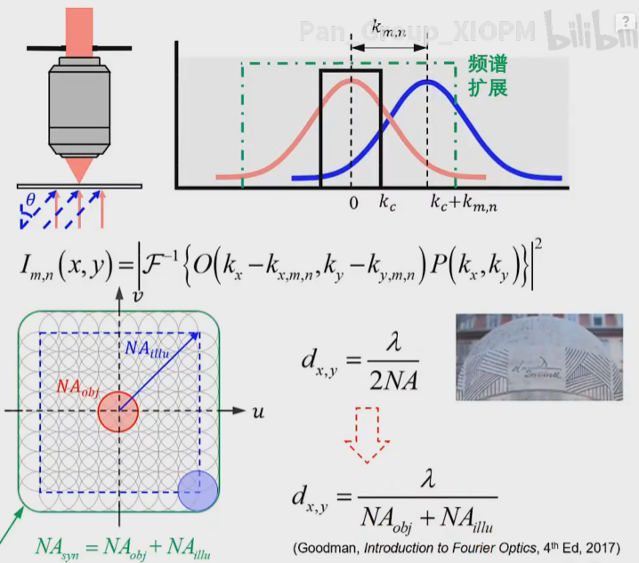

<!-- _class: cover_f -->
<!-- _paginate: "" -->
<!-- _footer: ""-->
<!-- _header:  -->

# <!-- fit --> My work on Fourier Ptychography
###### Algorithm Enhanced and QPI Realization

**Zhiping Wang** <zhiping.wang@stud.unibas.ch>
Master Student  
Biozentrum and Department of Mathematics and Informatics
University of Basel 
2024-11-29

---

<!-- _class: toc_a -->
<!-- _header: "CONTENTS" -->
<!-- _footer: "" -->
<!-- _paginate: "" -->

- [Introduction to FPM](#fourier-ptychography)
- [MEIF to Enhanced the Phase Information](#meif-to-enhanced-the-phase-information) 
- [Quantitative Phase Imaging Via Feature-Domain FPM](#quantitative-phase-imaging-via-feature-domain-fpm) 

## Fourier Ptychography

<!-- _class: trans -->
<!-- _footer: "" -->
<!-- _paginate: "" -->

#### Fourier Ptychographic Microscopy(FPM)

<!-- _class:  bq-red -->

> Fourier Ptychographic Microscopy(FPM)
> 
>FPM is a computational microscopy imaging technique aimed at **maximizing information** retrieval by collecting multiple images for final reconstruction.
> It simultaneously utilizes both **bright-field** and **dark-field** information to gather **high-frequency** details that are challenging to obtain with conventional methods, thereby improving resolution.

> Pipline of FPM
> 
>1 Raw Data Acquisition
2 Preprocessing raw data 
3 Image reconstruction

#### Principles of Fourier Ptychographic Microscopy
<!-- _class: cols-2-64 -->

**Principle:**
Multi-angle illumination effectively expands the numerical aperture (NA) range by utilizing both bright-field and dark-field information. **(maximizing information)**

**Result:**
+ Intensity: achieved 6x improvement while maintaining the same FOV(field-of-view).[NA increases from 0.1 NA to over 0.6]

+ Phase: Transition from no phase information to accessible phase data, enabling quantitative phase imaging (QPI) in certain cases.

## Raw Data Acquisition (parameters Experimental setup)

  

    

      
    

    

      
    

  

  

    (Ou et al., Opt. Lett., 2013)
  

#### Equipment

  

## My work
The resolution of FPM has already approached its theoretical limit, leaving limited room for improvement. However, another notable feature of FPM, its large field of view (FOV), presents certain challenges. My work primarily focuses on achieving **non-sliced** large-FOV imaging. [why sliching?](#why-slicing-we-want-to-slicing-free)
 
+ Linear-Space-Variant Model for FPM: Established a linear-space-variant model for Fourier Ptychographic Microscopy, enabling non-sliced imaging over a *1mm × 1mm* FOV (512 × 512 pixels) [Partially involved].

+ Fusion-Based Enhancement for Multi-Exposure FPM: Based on a feature-domain reconstruction (*3.3mm × 3.3mm, whole slide imaging*) algorithm that primarily reconstructs intensity information but exhibits weak phase reconstruction. My contributions **enhanced the phase information** significantly [Led the project].

+ Wide-Field Quantitative Phase Imaging Without Slicing: Achieved **quantitative phase imaging** under specific conditions using feature-domain FPM [Led the project].

+ Fast Full-Color Pathological Imaging: Contributed to a fast, full-color pathological imaging technique using Fourier Ptychographic Microscopy with a closed-form model-based colorization method, improving both colorization quality and processing speed [Partially involved].

## MEIF to Enhanced the Phase Information

<!-- _class: trans -->
<!-- _footer: "" -->
<!-- _paginate: "" -->

#### My Contribution

**Proposed multi-exposure image fusion (MEIF) Framework for Preprocessing of FPM:**

- **Aim:** Efficiently utilizing dark-field information to **increase the amount of information** for FPM reconstruction.
- **Results:** Both algorithms show significant **improvement**, exemplified here with FD-FPM.
- **Impact:** Notably beneficial for both new and traditional frameworks, applicable to various samples—a **generalized** preprocessing framework.  
  This marks the first successful integration of image fusion into computational microscopy and ptychography, to my knowledge.

## Image fusion network structure

## MEIF-FPM full pipeline

#### Result in Raw Data
<!-- _class: cols-2-64 navbar-->
<!-- _header: \ ***@MEIF***  *[Raw Data](#result-in-raw-data)* *[Standard Sample](#result-in-usaf)* *[Biological Sample](#result-in-onion-epidermis)*-->

Comparison between raw data from normal exposure and MEIF results. (a) Stitched image of raw data from normal exposure based on illumination angles. (b) Stitched image of MEIF results based on illumination angles. (c1-c3) Comparison of representative illumination angles between normal exposure (left) and MEIF images (right), with relative positions marked by colored rectangles in (a) and (b).

### Result in USAF
<!-- _class: cols-2-64 navbar-->
<!-- _header: \ ***@MEIF***  *[Raw Data](#result-in-raw-data)* *[Standard Sample](#result-of-usaf)* *[Biological Sample](#result-in-onion-epidermis)*-->

Reconstruction results of the USAF target. (a1) Whole slide imaging (WSI) reconstruction With MEIF ; (a2) Zoomed-in view of the MEIF reconstruction; (a3) Zoomed-in view of with HDR; (a4) Quantitative distribution corresponding to the lines in (a2) and (a3). (b1-b4) Phase reconstruction results with MEIF algorithm, magnified views, and the quantitative distribution along the indicated lines. (c1-c4) Phase reconstruction results with HDR algorithm, magnified views, and the quantitative distribution along the indicated lines.

## Result in Onion Epidermis
<!-- _class: cols-2-64 navbar-->
<!-- _header: \ ***@MEIF***  *[Raw Data](#result-in-raw-data)* *[Standard Sample](#result-in-usaf)* *[Biological Sample](#result-in-onion-epidermis)*-->

Reconstruction results of the onion epidermis. (a) WSI intensity reconstruction; (b) WSI phase reconstruction; (c1, d1, e1) Ground truth for ROIs 1-3; (c2-c7, d2-d7, e2-e7) Amplitude and phase reconstruction results for ROIs 1-3; {\color{black}(e8-e13)} Quantitative distribution for the line-scan regions in ROI 3 {\color{black}(e2-e7), where the horizontal coordinate is 0 to 25 microns.}

## Quantitative Phase Imaging Via XXX
<!-- _class: trans -->
<!-- _footer: "" -->
<!-- _paginate: "" -->

#### Simulation Results to QPI

<!-- _class: cols-2-64 navbar-->
<!-- _header: \ ***@QPI***  *[Simulation](#simulation-results-to-qpi)* *[Standard Sample](#results-of-siemens-star)* *[Biological Sample](#qpi-results-of-blood-cells)*-->

Simulation Results: (a) Ground truth and simulated phase input, (b) Phase recovery result of conventional FPM, (c) Phase recovery result of FD-FPM, (d,e) Comparative quantitative phase profiles of two regions of interest.

#### Results of Siemens star
<!-- _class: cols-2-64 navbar-->
<!-- _header: \ ***@QPI***  *[Simulation](#simulation-results-to-qpi)* *[Standard Sample](#results-of-siemens-star)* *[Biological Sample](#qpi-results-of-blood-cells)*-->

Experimental results of QPI: (a1)-(b1) Reconstruction results of intensity  (a2)-(b2) Reconstruction results of intensity and phase(a3, b3) Three-dimensional reconstruction results. 

#### QPI Results of Blood Cells
<!-- _class: cols-2-46 navbar-->
<!-- _header: \ ***@QPI***  *[Simulation](#simulation-results-to-qpi)* *[Standard Sample](#results-of-siemens-star)* *[Biological Sample](#qpi-results-of-blood-cells)*-->

QPI Results of Blood Cells: (a) Reconstruction result of FD-FPM. (b) Reconstruction results of conventional FPM. 
(c1-c3) Zoomed-in reconstruction results of ROI1, depicting the phase reconstructed by FD-FPM, traditional algorithm with slicing and splicing, traditional algorithm with global reconstruction, respectively. (d1-d3) Reconstruction results of ROI2, following the same sequence as (c1-c3), with a scale bar of 10 micrometers. (e1-e2) Thickness of normal red blood cells and abnormal red blood cells.

---
<!-- _class: lastpage -->
<!-- _footer: "" -->

###### Thanks

<!-- 

- <i class="fa-solid fa-envelope"></i>
  - <zhiping.wang@stud.unibas.ch>
- <i class="fa-brands fa-weixin"></i> 
  - 微信：favourhong  
- <i class="fa-solid fa-house"></i> 
  - 公众号：虹鹄山庄 -->

## Question
+ If I am admitted, what specific tasks or projects will I primarily be involved in? What will be the main focus of my work?

+ Is there anything I should prepare in advance to better contribute to the project?

+ How is the overall research timeline structured? Are there any milestone goals orintermediate deliverables?

+ What is the expected final output of this research? Will it be in the form of a publication, report, or experimental validation?

+ When can I expect to receive the final decision regarding my application?

#### Why Slicing? we want to Slicing-free

<!-- _class:  bq-purple -->

> why Slicing?
> 
> Illumination model is not perfect
Raw data is not perfect

+ leads artifacts!
+ so we want to Slicing-free

## Why FPM can QPI

**Fourier Transform and Resolution Expansion**

- For each image, the Fourier domain relationship is given by:

$$
I_i(x, y) = \left| \mathcal{F}^{-1} \left[ H(u, v) \cdot O(u - u_i, v - v_i) \right] \right|^2,
$$

**Phase Retrieval**
- Intensity measurements $I_i(x, y)$ lack direct phase information.
- Iterative algorithms, such as **Gerchberg-Saxton** or gradient-based methods, alternate between the real and Fourier space to recover phase:

$$
\phi_{n+1} = \arg \min \| I_{\text{measured}} - \left| \mathcal{F}^{-1} \left[ O_{\text{estimated}} \right] \right|^2 \|.
$$
**Quantitative Phase Imaging**
- The reconstructed complex optical field $E(x, y)$ enables explicit extraction of phase $\phi(x, y)$, directly related to optical path differences (OPD) and refractive index variations:

$$
\phi(x, y) = \frac{2\pi}{\lambda} \Delta n(x, y) \, t(x, y),
$$

## How to realize phase imaging

  

    (Zhang R. et al., Laser & Optoelectronics Progress, 2021.)
  

